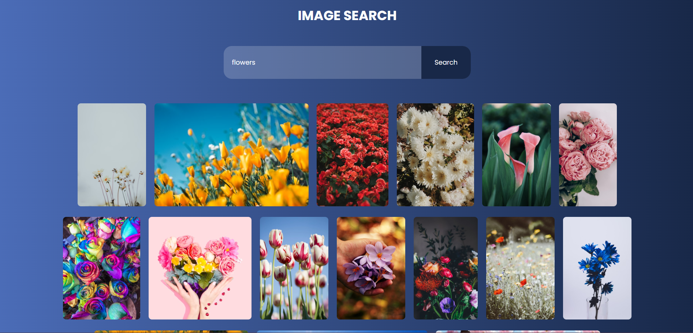

# Image Search Engine

An **Image Search Engine** project built using HTML, CSS, and JavaScript. This application allows users to search for images by entering a keyword, fetching results from an image API, and displaying them in a visually appealing grid layout.

## Features

- Search for images using keywords.
- Responsive design that adapts to different screen sizes.
- Displays results dynamically with JavaScript.
- Includes error handling for empty search queries or API issues.

## Demo

 <!-- Add a screenshot of your project here -->

## Technologies Used

- **HTML**: Structure of the application.
- **CSS**: Styling and layout of the application.
- **JavaScript**: Dynamic content fetching and rendering.
- **API**: Integration with an image search API (e.g., Unsplash API or Pixabay API).


## File Structure

```
image-search-engine/
├── index.html          # Main HTML file
├── style.css           # Stylesheet for the project
├── script.js           # JavaScript file for functionality
├── img                 # Project screenshot
└── README.md           # Project documentation
```

## Usage

1. Enter a keyword in the search bar and press Enter or click the Search button.
2. View the results in a grid layout.
3. Click on any image to view it in full resolution (optional feature).


## Customization

- Modify `style.css` to personalize the design.

## Future Improvements

- Add pagination for more results.
- Enable downloading of images.
- Support for multiple image providers.

## License

This project is licensed under the MIT License. Feel free to use and modify it as needed.

---
